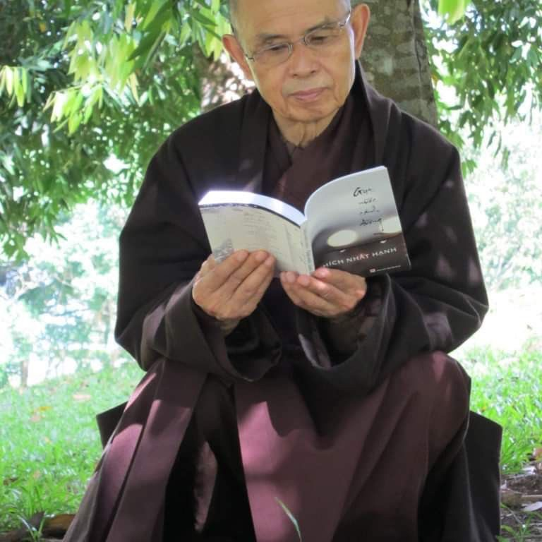
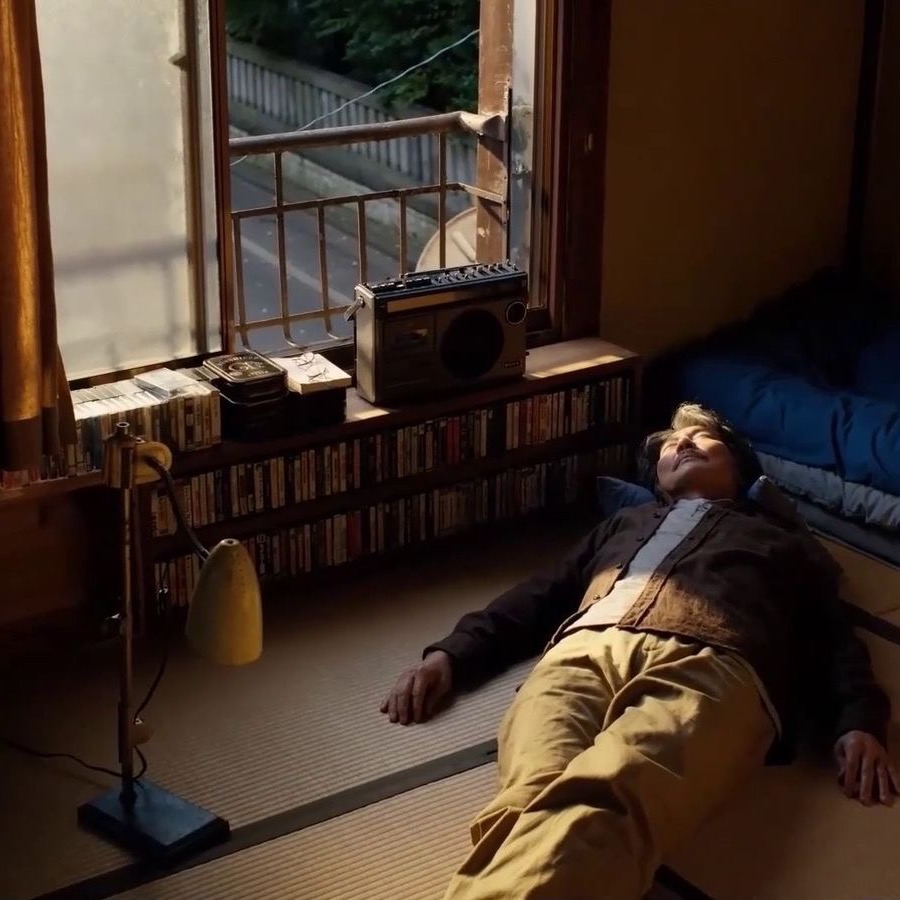
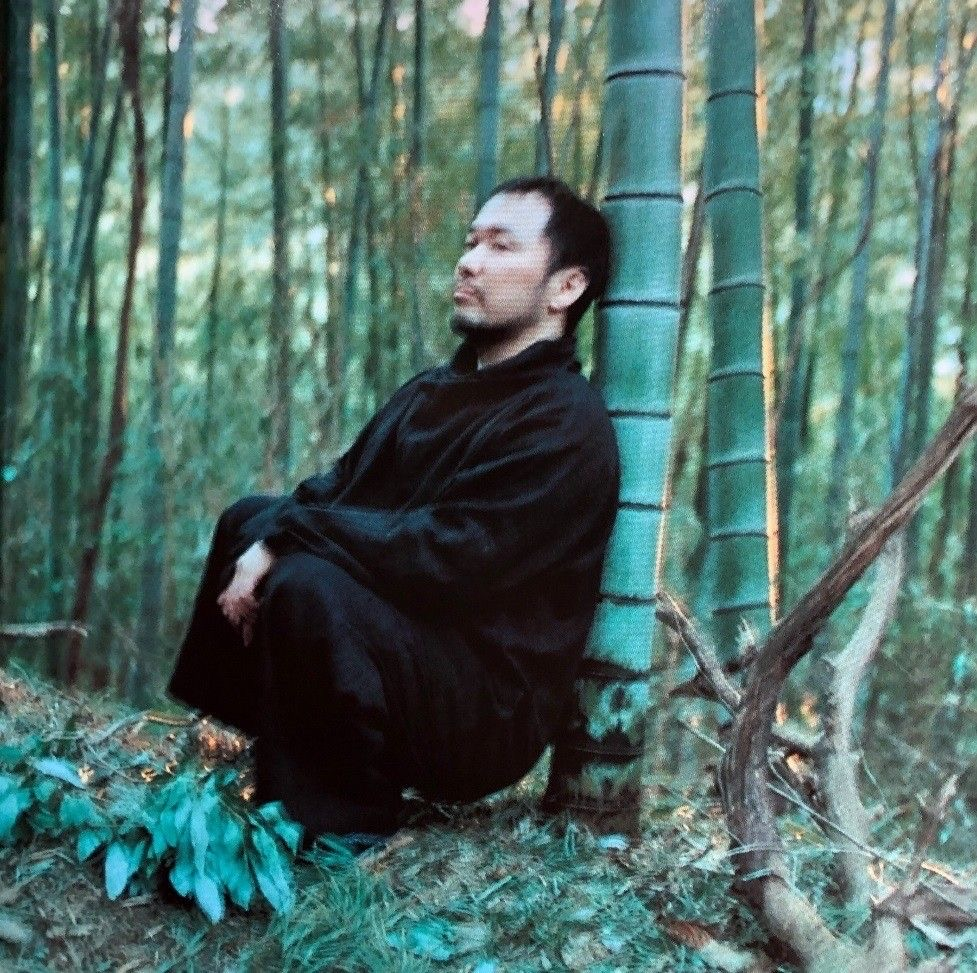
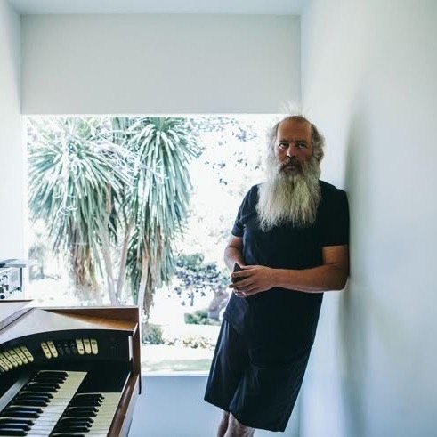
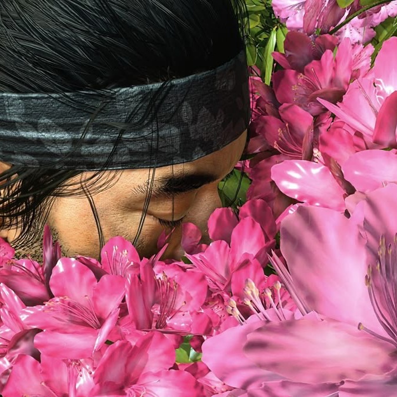

### Komorebi
#### Inspired by the late Thich Nhat Hanh.
*A reminder to breathe and stay grounded throughout the day, regardless of the activity or environment around you.*

*Rest in peace.*

After finishing my degree I wanted to find something that genuinely helped me feel calm and present. Listening to his Dharma talks gave me that. This app is a small attempt to carry some of that stillness into daily life — a quiet nudge to slow down and breathe, especially as things get busier.

His teachings, along with those of Eckhart Tolle and Sodo Yokoyama, have shaped how I aim to move through the day.

The photos above reflect the feeling behind the app. Below are some of the designs I explored in Figma as I built it out. For greater ideas on the mood I wanted to capture within the application:

<table>
  <tr>
    <td></td>
    <td></td>
    <td></td>
  </tr>
</table>
