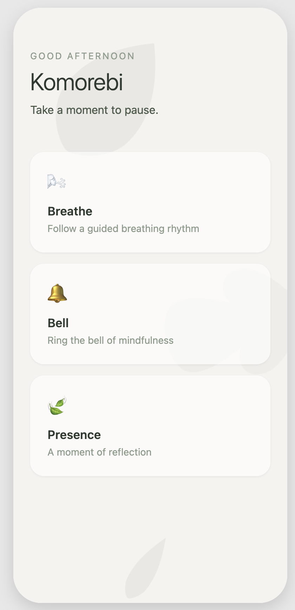
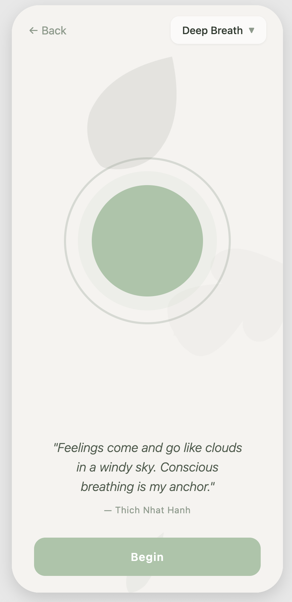
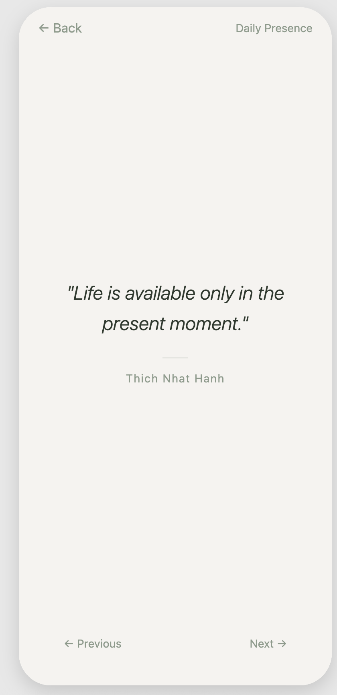

### Komorebi
#### Inspired by the late Thich Nhat Hanh.
*A reminder to breathe and stay grounded throughout the day, regardless of the activity or environment around you.*

*Rest in peace.*

After finishing my degree I wanted to find something that genuinely helped me feel calm and present and listening to his Dharma talks gave me that. This app is a small attempt to carry some of that stillness into daily life — a quiet nudge to slow down and breathe, especially as things get busier.

His teachings, along with those of Eckhart Tolle and Sodo Yokoyama, have shaped how I aim to move through the day.

The photos reflect the feeling behind the app. For greater ideas on the mood I wanted to capture within the application, I took inspiration from others as pictured (yes even Jin Sakai):

  
  &nbsp;
  
  &nbsp;
  

The app was designed with the intention of being the most minimilistc as it could and give me what I wanted. I ran into issues with Plum Villages app and the bloat that came with it. Maybe I am just lazy.

  
  &nbsp;
  
  &nbsp;
  

